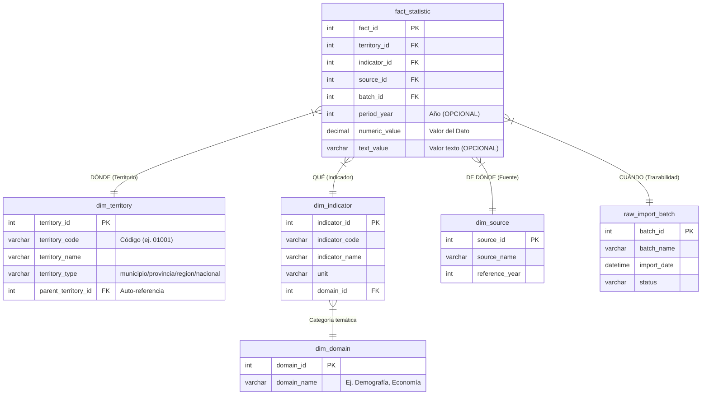

# Arquitectura de Datos: Esquema Estrella (Star Schema)

Este documento explica la estructura de base de datos normalizada ("Canonical Schema" - Fase 2) implementada en el backend del Dashboard Territorial. Está diseñado para ser presentado a ingenieros de datos y administradores de bases de datos (DBA) de la Oficina Nacional de Estadística (ONE).

---

## 1. Visión General: El Modelo Dimensional

La base de datos utiliza un **Modelo Dimensional / Esquema en Estrella (Star Schema)**, que es el estándar de la industria (basado en la metodología de Ralph Kimball) para bases de datos analíticas y Data Warehouses (DWH).

En este modelo, la base de datos se divide en dos tipos de tablas principales:
1. **Fact Table (Tabla de Hechos)**: Contiene los datos cuantitativos medibles (los números).
2. **Dimension Tables (Tablas de Dimensiones)**: Contienen los atributos descriptivos (contexto) que dan significado a los hechos.

---

## 2. Diagrama de Entidad-Relación (ERD)

---

## 3. Descripción de las Tablas

### 3.1. La Tabla Central de Hechos
#### `fact_statistic` (Hechos Estadísticos)
*   **Rol:** Almacena exclusivamente el cruce numérico de información. Ejemplo: "En 2022, el municipio X tenía Y habitantes".
*   **Características Clave:**
    *   No almacena texto directamente (como nombres de ciudades), solo IDs (`foreign keys`). Esto permite que la tabla escale a millones de registros manteniendo consultas y agregaciones súper rápidas (`SUM`, `AVG`, etc.).
    *   Tiene una restricción **`UNIQUE` (territory_id, indicator_id, source_id, period_year)**. Esto previene la duplicación de datos y permite realizar operaciones `UPSERT` seguras en pipelines automatizados.

### 3.2. Las Tablas de Dimensiones (Contexto)
Estas tablas definen el significado de los IDs de la tabla de hechos.

#### `dim_territory` (Dimensión Territorial)
*   Contiene el catálogo maestro geográfico: Nacional, Regiones, Provincias y Municipios.
*   Utiliza una estructura de jerarquía recursiva mediante la columna `parent_territory_id` (ej. el "padre" de un municipio es su provincia). Esto hace al esquema ultra flexible ante posibles cambios en la división político-administrativa del país.

#### `dim_indicator` (Dimensión de Indicadores)
*   Catálogo de todas las métricas almacenadas (ej. "Población Total", "Tasa de Uso de Internet").
*   Define la `unit` (absoluto o porcentaje) y el `aggregation_method` (suma, promedio ponderado), dictando cómo debe comportarse este indicador al agruparse.

#### `dim_domain` (Dimensión de Dominio Temático)
*   Clasificación de alto nivel para agrupar indicadores (ej. "Demografía", "Hogares y Viviendas", "Economía y Empleo").

#### `dim_source` (Dimensión de Fuentes)
*   Rastrea el origen de los datos de cada estadística (ej. "X Censo Nacional 2022", "Registro DEE 2024"). Esencial para mantener la integridad oficial y presentar la referencia bibliográfica correcta en el frontend.

### 3.3. Trazabilidad y Auditoría
#### `raw_import_batch` (Historial de Procesamiento)
*   Tabla operativa que registra "quién, cuándo y desde dónde" se insertaron los datos.
*   Proporciona pistas de auditoría integrales y permite revertir o diagnosticar errores en cargas de ETL (Extract, Transform, Load).

---

## 4. Ventajas Técnicas (Puntos clave para el equipo ONE)

1.  **Alineación con Data Warehousing y BI Moderno:** Este diseño en forma de estrella es el formato exacto requerido por herramientas como **Power BI** o SQL Server Analysis Services (SSAS). Si ONE decide integrar esto en su DWH institucional en SQL Server, la migración es directa.
2.  **Extensibilidad Infinita mediante "Breakdowns":** 
    Si en el futuro se requiere analizar un indicador introduciendo nuevos ejes (por ejemplo: "Educación dividida por Sexo y Rango de Edad"), no es necesario romper la estructura actual. Simplemente se añaden nuevas tablas puente (`dim_breakdown_type`, `dim_demographic_slice`) adosadas a la tabla de hechos.
3.  **Optimizada para Rendimiento Híbrido:** 
    Aunque la Base de Datos mantiene este estricto nivel de integridad y normalización, el Dashboard de React **NO** hace consultas de `JOIN` en tiempo real que podrían ralentizar el portal. En su lugar, utilizamos un proceso "Pipeline" que periódicamente compila este *esquema estrella* en "Objetos JSON de Entrega Rápida" (`dataset_assets`), garantizando una experiencia de usuario extremadamente veloz.
